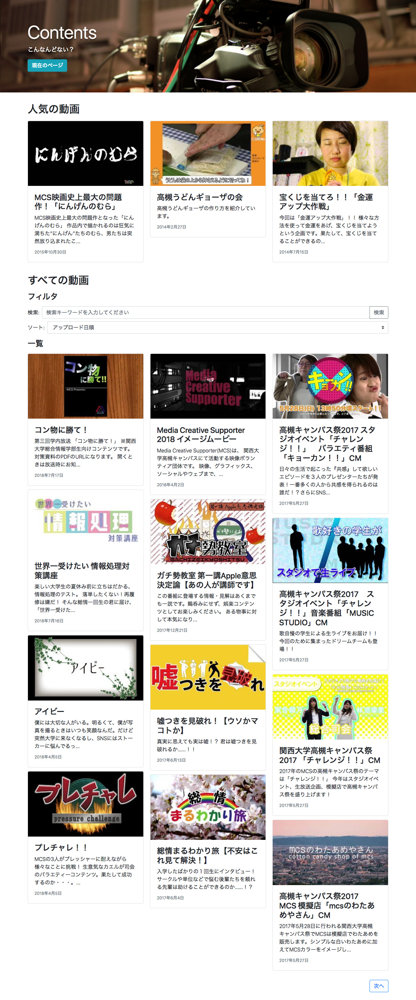

# MCS-React-Test

MCSのサイトリニューアル前（[当時のリポジトリ](https://github.com/MCS-kutc/website)）に提案したコンテンツ一覧ページのプロトタイプです．

BootstrapとjQuery，React，Babelを使用して制作しました．また，コンテンツはYouTube Data APIを使用して取得しています．

## スクリーンショット

